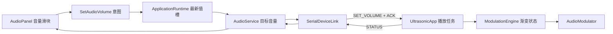

# 连续音量控制设计与实现

> 状态：已实现；硬件阵列上的实际声压曲线仍需测量。适用入口：`src/vision_gimbal` 桌面端与 `src/full_size` 正式固件。

## 目标和范围

- 桌面端提供 0～100% 滑块，播放时可连续调节，无须停止、重新预缓冲或重建音源。
- 同一主音量作用于麦克风、立体声混音、WASAPI 进程回环和固件内置 Flash PCM。
- 0% 最终使 GPIO4 超声 PWM 占空比为 0；“关闭音频链路”和现有故障静音仍独立生效，且优先级更高。
- 固定载波和测试纯音是台架诊断路径，暂不受主音量影响。它们仍由原有的显式启动、停止命令控制。
- 100% 等于当前音频输出基线；音量控制只衰减，不提升现有最大调制深度。

这里的百分比是用户控制位置，不是经过校准的声压级。非零音量主要改变可听音频的调制深度；DSB-AM 的载波基线仍存在，不能把滑块当作超声暴露或功率保护装置。

## 放置位置

```text
实时音源 → PC 滤波/重采样/自动电平/压缩/限幅 → PCM_U8 ─┐
                                                        ├→ ESP32 RAW/LOUD
固件 Flash PCM ──────────────────────────────────────────┘         ↓
                                                   主音量与渐变（共同路径）
                                                              ↓
                                               DSB-AM/SRAM → PWM duty → GPIO4
```

主音量放在固件的 `RAW/LOUD` 处理之后、`DSB-AM/SRAM` 查表之前。若放在电脑端慢速电平控制之前，自动电平会抵消音量变化；若放在电脑端量化前，固件的 LOUD 非线性处理会改变滑块响应，而且 Flash PCM 无法共用。不要用调节 12 V 电源、载波频率或 LEDC 整体占空比替代音频音量控制。

固件可将 LOUD 后的 8 位样本转成以 128 为中心的有符号值，乘以当前音量增益，再送入现有调制映射。0% 是特殊状态：不能只发送 PCM 静音值 128，因为现有 DSB-AM/SRAM 映射仍会输出固定超声载波；到达零增益时必须写入 `duty=0`。实时流在 0% 时继续消耗缓冲样本和维护时钟，恢复非零音量时不必重新建立流。

当前控制曲线：非零位置从约 −30 dB 连续映射到 0 dB，0% 为关闭输出。使用单调的分贝映射而非线性幅值映射；实际低端手感应以测量和试听调整。当前传输为 PCM_U8、输出为 10 位 PWM，极低音量的有效分辨率有限，不应承诺每个百分比都有可分辨的声压变化。

## 控制和状态流



1. `AudioPanel` 显示百分比和 0% 的“静音”字样。拖动时最多每 50 ms 发布一次最新值，松手立即发布最终值。滑块的鼠标滚轮事件转交侧栏滚动区域，避免浏览面板时误调音量。
2. 新增独立的 `SetAudioVolume` 意图和 `AudioService.set_volume()`。音量不放进现有 `AudioModeSettings`，因为 `AudioService.configure()` 会重启正在运行的流。应用层和串口层只保留尚未发送的最新音量，防止拖动产生无界控制队列。
3. `SerialDeviceLink` 保存期望音量，串口重连后先重发音量，再发 `STREAM_START`。一个可靠命令仍须等其 ACK 后才发送下一个可靠命令；音频帧可按现有机制继续发送。`SET_MUTE` 和 `STREAM_STOP` 的停止语义优先于音量变化。
4. 固件协议任务验证音量范围并入队；播放任务独占当前增益、目标增益和驱动写入。以约 40 ms（8 kHz 下 320 个样本）渐变，避免每次拖动产生突变。`skipFrames()` 必须按跳过的样本数推进渐变，否则定时积压时音量变化会被拉长。
5. `SET_VOLUME` 在流停止、音源切换和活动门限暂停期间仍更新目标；Flash PCM 使用同一增益。无桌面端时可用台架文本命令 `V0`～`V100` 调节 Flash 播放。

## 协议增量

保留当前帧格式和协议版本 1，增加可协商能力：

| 字段 | 设计 |
|---|---|
| `HELLO_ACK` 能力位 | 新增 bit 2：支持主音量；旧固件的 `0x00000003` 保持可识别 |
| `SET_VOLUME` | 消息类型 `0x08`，PC→ESP，可靠控制命令 |
| payload | 小端 `u16 volume_permille`，允许 `0..1000`；越界或长度错误以错误 ACK 拒绝 |
| `STATUS[30:32]` | 利用当前保留的两个字节回报固件接受的目标音量；仅在能力位存在时解释 |

新桌面端遇到没有音量能力位的旧固件时，禁用滑块和音频启动按钮，并在 `AudioService.start_transmitting()` 处再次拒绝启动；若启动请求发生在握手完成之前，`SerialDeviceLink` 也会在确认能力位之后才允许发送 `STREAM_START`。这样自动启动或其他调用不会使设定的初始音量失效、却以 100% 播放；视觉和云台功能可继续使用。旧桌面端连接新固件时，固件沿用原有 100% 默认音量，维持现有 Flash 和实时播放行为。新桌面端从 `[audio.volume]` 读取初始值（当前 50%），并在首次 `STREAM_START` 之前下发。

## 与现有静音和显示的关系

- `volume=0` 时实时缓冲仍可处于 `PLAYING`；`STATUS.muted=true` 应在增益渐变完成且 PWM 关闭后回报。不要因此把流状态改为 `MUTED`，否则桌面端现有的 `_device_stream_needs_rearm()` 会把它误判为需要重建的流。
- `SET_MUTE(true)`、`STREAM_STOP`、欠载、超时和驱动错误仍立即按现有路径关闭 PWM；音量上升不能取消这些状态。
- 进程回环活动门限继续基于音量控制前的 `post_limiter_samples` 判断真实输入活动，否则 0% 会被误认为音源数字静音。现有录音和频谱抽头也保留在音量控制之前，并在界面注明它们显示的是输入音频，不是阵列声压。
- UI 状态同时保留“期望音量”和固件确认的目标音量；重连期间显示等待同步，不把滑块位置当作已经生效的硬件状态。

## 实现位置

| 层 | 文件 | 主要变化 |
|---|---|---|
| UI / 应用 | `src/vision_gimbal/ui/audio_panel.py`、`src/vision_gimbal/ui/main_window.py`、`src/vision_gimbal/ui/presenter.py`、`src/vision_gimbal/ui/view_models.py`、`src/vision_gimbal/domain/intents.py`、`src/vision_gimbal/application/runtime.py` | 滑块、意图、状态显示和最新值合并 |
| 音频服务 | `src/vision_gimbal/domain/audio.py`、`src/vision_gimbal/application/audio_service.py`、`src/vision_gimbal/config/schema.py`、`configs/vision_gimbal.toml` | 音量合同、初始值、状态和独立控制方法 |
| 传输 | `src/vision_gimbal/ports/device_link.py`、`src/vision_gimbal/infrastructure/serial_device_link.py`、`src/vision_gimbal/protocol/messages.py`、`src/vision_gimbal/infrastructure/null_device_link.py` | 新命令、能力位、ACK、重连恢复和队列合并 |
| 固件 | `src/full_size/src/protocol/*`、`src/full_size/src/app/ultrasonic_app.*`、`src/full_size/src/modulation/modulation_engine.*`、`src/full_size/src/modulation/audio_modulator.*` | 验证、状态、渐变、两类音源共用处理和零音量 PWM 关闭 |

## 验收重点

1. 单元测试覆盖 `0/1/50/100%`、音量曲线单调、越界拒绝、RAW/LOUD 与 DSB-AM/SRAM、音源切换与串口重连、控制队列合并；拖动音量不产生新的 `STREAM_START`。
2. 固件验证 Flash 与实时 PCM 对同一音量命令都有响应；0% 的 GPIO4 无 40 kHz 切换，而缓冲仍持续前进；从 0% 恢复时无需重新预缓冲。
3. 不接 12 V 时先检查协议 ACK、STATUS、GPIO4 duty 和渐变时长；随后按现有单驱动到整阵列步骤验证，并观察快速拖动和 0% 往返是否出现明显瞬态。
4. 验证调低音量不会被电脑端自动电平或固件 LOUD 模式补偿，也不会改变进程回环的静音活动门限。实际百分比与可听声压关系需用合适仪器实测校准。
